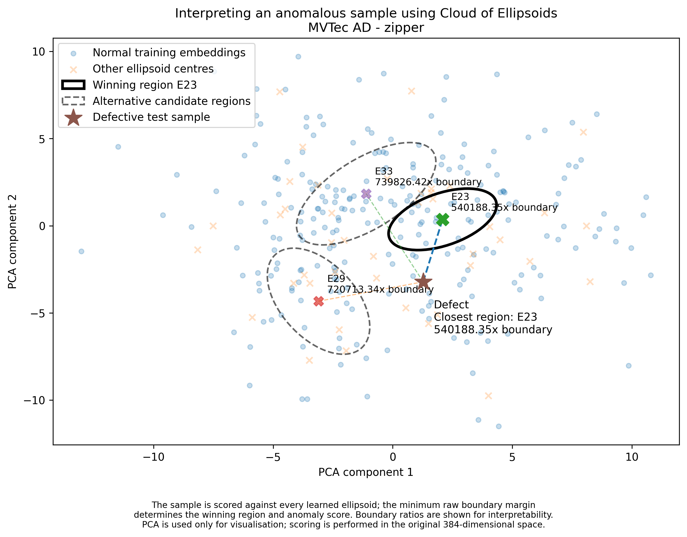

> **Project Status:** This project is ongoing. The repository contains work completed during my 2026 University of Limerick Summer Research Bursary and is being extended as my Final Year Project during 2026/27. Additional experiments, evaluation, optimisation, and documentation are currently in development.

# Out of Distribution Detection in MvTec AD using DINO Transformers
## Introduction and Motivation

Many anomaly-detection methods represent the normal class using a single global distribution. A new sample is then scored according to how well it fits this global representation, with sufficiently unusual samples classified as anomalous. However, this assumes that the normal data can be represented adequately by a single distribution, which may not hold when the normal embedding space is multimodal.

This project investigates whether representing normal data using multiple local regions can improve both anomaly detection performance and the interpretability of the learned embedding space.

The work builds on the [*Cloud of Spheres*](https://www.sciencedirect.com/science/article/pii/S2192440623000217) method, which models a feature space using multiple spherical regions in a supervised setting. Spherical regions, however, can be restrictive when the underlying embedding space is anisotropic. A sphere must expand equally in every direction to include additional points, potentially causing it to cover large unsupported areas of the feature space.

Two main extensions are explored in this project. First, *Cloud of Spheres* is adapted to an unsupervised setting, requiring changes to several assumptions made by the original method in [*Unsupervised Hypersphere*](notebook/arlgorithms/unsupervised_hypersphere_fit.ipynb). Second, spheres are replaced by ellipsoidal regions, producing the proposed *Cloud of Ellipsoids* representation. Ellipsoids can independently model the scale and orientation of local feature distributions, allowing each region to better follow the geometry of the embedding space.

The resulting multi-region representation is compared against a global Mahalanobis-distance baseline using embeddings extracted from [DINOv2](https://arxiv.org/abs/2304.07193) on the [MVTec AD](https://www.mvtec.com/research-teaching/datasets/mvtec-ad) dataset. The aim is not only to determine whether local modelling improves anomaly scores, but also whether it provides a more meaningful description of the different forms that normal data can take.
For example, consider an object whose appearance changes substantially depending on its orientation, such as a cube with a different image on each face. Although all six views belong to the same normal object class, their embeddings may form several distinct clusters rather than one homogeneous distribution. An anomalous sample could produce an embedding positioned between two of these clusters without being strongly supported by either. A single global distribution may still assign this intermediate region a relatively normal score because it models the class as a whole. In contrast, a multi-region representation can explicitly model each normal mode and identify areas that lie between them but are not well supported by any individual region.

One possible response would be to treat each of these modes as a separate class. For a single cube, for example, its six faces could theoretically be modelled as six subclasses. However, this becomes increasingly impractical as the number and geometric complexity of objects grows. Consider a dataset containing 15 different object types, including cubes, prisms, spheres and other irregular shapes, each observed from multiple orientations. Explicitly defining classes for every object-view combination would rapidly increase the number of labels, while also requiring a prior decision about what constitutes a distinct normal mode.

This becomes particularly problematic in a realistic setting such as a production line where all of these object types may appear on the same conveyor belt. It would be possible to first classify the incoming object and then route it to a specialised anomaly detector, for example through a Mixture-of-Experts architecture. However, this introduces an additional classification and routing problem, requires either further supervision or specialised training, and creates another source of potential error. Exploring such architectures is outside the scope of this work.

Instead, this project asks whether these different modes of normality can emerge directly from the embedding space itself. Rather than manually assigning every normal variation to a separate class, the proposed multi-region approach attempts to discover and model locally supported regions within the normal distribution. This preserves a single anomaly-detection problem while allowing the representation of normality itself to remain multimodal.

This motivates the central question of the project: **can a multimodal representation of normality provide better anomaly detection and a more interpretable model of the normal embedding space than a single global representation?**

## Project Documents

- [Cloud of Ellipsoids Paper](.documents/Cloud_of_Ellipsoids.pdf)
- [Data Exploration Write-up](.typst_docs/write_up/main.pdf) *(in progress)*

## Key Findings

- Cloud of Ellipsoids underperforms the global Mahalanobis baseline on raw AUROC (0.934 vs. 0.958), and this gap holds up under 1,000-sample bootstrap resampling on both the training and test sets.
- The apparent win on "screw" disappears once bootstrapped , a reminder that single-category improvements need robustness checks before being trusted.
- The main trade-off: Mahalanobis wins on raw separation, but Cloud of Ellipsoids offers richer interpretability, each sample is explained relative to a specific local normal mode rather than a single global distribution, at ~6.5–11x the computational cost.
- An SVD-based reformulation of ellipsoid fitting gave a ~47x speedup (5.46s → 115ms), making it practical to iterate on the method at the scale needed for the bootstrap analysis above.

## Table of Contents

- [Overview](#overview)
  - [Embedding Space Analysis](#embedding-space-analysis)
    - [Dataset Analysis](#dataset-analysis)
    - [Baseline Anomaly Detection](#baseline-anomaly-detection)
    - [Embedding Visualisation](#embedding-visualisation)
    - [Clustering Analysis](#clustering-analysis)
  - [Cloud of Ellipsoids](#cloud-of-ellipsoids)
    - [Unsupervised Hypersphere](#unsupervised-hypersphere)
    - [From Hyperspheres to Ellipsoids](#from-hyperspheres-to-ellipsoids)
      - [Growth Rate](#growth-rate)
      - [Candidate Cleaning](#candidate-cleaning)
      - [Ellipsoid Fitting](#ellipsoid-fitting)
      - [Low-support Ellipsoids](#low-support-ellipsoids)
      - [Scoring](#scoring)
    - [Hyperparameter Table](#hyperparameter-table)
  - [Results](#results)
    - [Bootstrap Robustness](#bootstrap-robustness)
    - [Computational Cost](#computational-cost)
    - [Interpretability](#interpretability)

## Overview

The work in this repository can be divided into two main areas:

1. **Embedding Space Analysis**
2. **Multi-Region Modelling and Evaluation**

### Embedding Space Analysis

The first part of the project investigates both the structure of the dataset and the embedding spaces produced by DINOv2 before any representation adaptation or multi-region modelling is applied.

#### Dataset Analysis

The dataset is first explored in [Data Analysis](notebooks/data_books/data_analysis.ipynb) to understand its composition and identify characteristics that may influence later anomaly-detection experiments. This includes:

* Train/test and normal/defect splits
* Whether some object categories contain substantially more images than others
* The distribution of defective samples across categories
* The different defect types present within each category
* Variation in defect size, including unusually large or small defects
* Visual comparisons between defective samples and their corresponding normal appearance
* Image characteristics that may need to be considered during preprocessing and normalisation

This provides context for later results, particularly where differences in category composition or defect characteristics may affect anomaly-detection performance.

#### Baseline Anomaly Detection

The next stage, covered in [Embedding Space Analysis](notebooks/embedding_analysis/baseline.ipynb), evaluates how well the pretrained DINOv2 embeddings separate normal and defective samples without any fine-tuning.

Several simple anomaly-scoring methods are compared:

* [K-Nearest Neighbour](http://dx.doi.org/10.1145/3459665) (KNN)
* Average KNN distance (\(k=5\))
* Distance from the normal-class centroid
* [Mahalanobis distance](https://arxiv.org/abs/2003.00402)

Mahalanobis distance is selected as the primary global baseline. In addition to its performance, it provides a useful comparison for the later multi-region approach: rather than fitting a single global distribution to all normal embeddings, the proposed method can be viewed as fitting several local Mahalanobis-like regions to different parts of the normal embedding space.
Theres also a brief notebook for determining which layer performs the baseline the best in [Dino Layers](notebooks/embedding_analysis/dino_layer_analysis.ipynb) to see if the final DINO layer should be chosen for further analysis which it was found it was.

#### Embedding Visualisation

The structure of the embedding space is then explored in [Embedding Visualisation](notebooks/embedding_analysis/emb_visualisation.ipynb) using three dimensionality-reduction techniques:

* [PCA](https://arxiv.org/abs/1404.1100)
* [t-SNE](http://jmlr.org/papers/v9/vandermaaten08a.html) 
* [UMAP](https://arxiv.org/abs/1802.03426)

These visualisations are used to investigate how DINOv2 naturally partitions the data before any task-specific fine-tuning. In particular, they help determine whether normal samples form a single coherent distribution or whether distinct local modes are already visible within individual object categories.

#### Clustering Analysis

The final part of the initial embedding analysis examines how strongly structured these groups remain in the full 384-dimensional DINOv2 embedding space.

Several clustering and separation metrics are evaluated:

* [Silhouette Score](https://doi.org/10.1016/0377-0427%2887%2990125-7)
* Inter-cluster and intra-cluster distance
* [Davies-Bouldin Index](https://doi.org/10.1109/TPAMI.1979.4766909)
* [Calinski-Harabasz Index](https://doi.org/10.1080/03610927408827101)

These metrics are calculated for both **CLS-token embeddings** and **patch-level embeddings**.

Further analysis in [Correlation Analysis](notebooks/stats_books/corr.ipynb) examines how these measures relate to anomaly-detection performance, particularly AUROC, and whether similar relationships are observed across different embedding aggregation strategies.

### Cloud of Ellipsoids

The main methodological contribution of this project begins with the adaptation of Cloud of Spheres to an unsupervised setting. The initial fitting procedure is explored in the Unsupervised Hypersphere notebook, which investigates how local regions can be discovered without predefined class assignments.

#### Unsupervised Hypersphere

The algorithm begins by using K-Nearest Neighbours to identify dense local regions within the normal embedding space. Rather than selecting a fixed value of (k), the neighbourhood size is defined as a percentage of the total number of training samples. Values of 2.5%, 5%, and 10% were evaluated to determine a neighbourhood size that was large enough to represent meaningful local structure without becoming so large that a single hypersphere captured an excessive portion of the embedding space. A value of 5% was selected for the experiments presented here.

However, the initial KNN neighbourhood only captures samples immediately surrounding the selected dense point. To allow a hypersphere to incorporate nearby samples that fall just outside this initial neighbourhood, an additional growth term is introduced. Each candidate hypersphere is allowed to expand by 5% during successive growth steps, adding newly covered normal embeddings where possible.

Both the neighbourhood percentage and growth rate are empirical hyperparameters rather than universally optimal values. The examples in the notebook show that a 5% growth rate does not behave equally well across every MVTec AD category, suggesting that category-specific or adaptive parameter selection may be worth investigating in future work.

Moving from the supervised setting of the original Cloud of Spheres method to an unsupervised setting also removes several constraints that would otherwise limit how regions are formed. In particular, unrestricted growth could allow hyperspheres to expand into areas already represented by another region.

To prevent this, each normal training embedding may be assigned to only one hypersphere. Candidate hyperspheres are therefore cleaned during fitting so that previously assigned samples cannot be captured again. This encourages each hypersphere to remain associated with its own locally supported subset of the training data.

Importantly, this restriction applies only to the observed training samples. Hyperspheres are still permitted to overlap in regions of the embedding space where no training samples are present. Since these areas are unsupported by observed data, assigning ownership of such space to one hypersphere over another would introduce an additional arbitrary assumption.

The resulting unsupervised hypersphere fitting procedure is:

1. **Initialise uncovered embeddings**  
   All normal embeddings begin as uncovered. A boolean mask is used to track which embeddings have not yet been assigned to a hypersphere.

2. **Find the densest uncovered region**  
   For the current set of uncovered embeddings, a FAISS KNN search is performed. The embedding with the smallest average distance to its neighbours is selected as the centre of the densest local  region.

3. **Create an initial candidate hypersphere**  
   The densest embedding and its nearest neighbours form the first candidate region. This candidate is cleaned to ensure it does not contain embeddings already assigned to previous hyperspheres.

4. **Grow the candidate hypersphere**  
   If the initial candidate is valid, the hypersphere is expanded using a small growth factor. Newly included uncovered embeddings are added to the candidate region.

5. **Clean after growth**  
   After each growth step, the candidate is cleaned again. If the cleaned candidate contains more embeddings than before, the growth is accepted. Otherwise, growth stops.

6. **Store the final hypersphere**  
   Once no further valid growth is possible, the final centroid, radius, and assigned embedding indices are stored. These embeddings are then marked as covered.

7. **Repeat until full coverage**  
   The process repeats until every normal training embedding has been assigned to a hypersphere.

#### From Hyperspheres to Ellipsoids

Although the core region-discovery procedure remains similar, several changes are required when moving from hyperspheres to ellipsoids.

##### Growth rate

The first change concerns how regions are allowed to grow. In the hypersphere method, growth is isotropic: increasing the radius expands the region equally in every direction. Applying the same rule to an ellipsoid would undermine the purpose of introducing anisotropic regions, as each axis would still be expanded uniformly regardless of the structure observed in the local embedding distribution.

To address this, the ellipsoidal method introduces variance-aware growth. Rather than expanding every axis by the same amount, growth is weighted according to the variance observed along each principal axis of the local region. Axes with greater observed variance are therefore allowed to grow more strongly, while axes with little variance remain comparatively constrained.

For each principal axis (i), a relative growth scaling factor is calculated as:

$$
r_i = \max\left(\frac{\lambda_i}{\lambda_{\max}}, r_{\min}\right)
$$

where:

* $\lambda_i$ is the eigenvalue associated with axis $i$,
* $\lambda_{\max}$ is the largest eigenvalue within the region,
* $r_i$ is the relative growth factor for that axis,
* $r_{\min}$ defines a minimum permitted growth factor.

Then growth is calculated as:

$g_i = gr_i$

where $g$ is the growth rate of the ellipsoid which is increased to 10%.

Normalising by $\lambda_{\max}$ means the direction containing the greatest observed variance receives the full growth rate, while lower-variance directions receive proportionally smaller growth. The $r_{\min}$ term prevents axes with very small variance from becoming completely unable to expand.

This allows an ellipsoid to preferentially grow in directions already supported by the local data rather than expanding equally into unsupported areas of the embedding space.

##### Candidate Cleaning

In the hypersphere method, overlap with previously assigned samples can only be resolved by shrinking the candidate sphere, effectively removing samples from the candidate until the radius becomes small enough to eliminate the conflict.

The ellipsoidal case allows a more targeted form of cleaning. Rather than immediately removing a candidate sample, this method assigns each sample within the candidate ellipsoid a weight

$$
w_j \in [0,1]
$$

which determines how strongly that sample contributes when the ellipsoid is fitted.

When a previously assigned embedding $x_s$ lies inside the candidate ellipsoid, its contribution along each retained principal axis is evaluated as

$$
c_i(x_s) =
\frac{\left(v_i^T(x_s-\mu)\right)^2}{\lambda_i}
$$

where $v_i$ and $\lambda_i$ are the eigenvector and eigenvalue associated with principal axis $i$.

The axis along which the conflicting embedding contributes most strongly is then selected as

$$
i^* = \arg\max_i c_i(x_s)
$$

Reducing the candidate variance along this direction provides the most direct way of moving the conflicting embedding towards, and eventually outside, the ellipsoid boundary.

The candidate embedding contributing most strongly to this same axis is therefore selected as

$$
j^* = \arg\max_j
\frac{\left(v_{i^{\ast}}^T(x_j-\mu)\right)^2}{\lambda_{i^{\ast}}}
$$

Rather than immediately discarding $x_{j^*}$, its weight is reduced. A binary search is used to determine the largest weight that removes the encroachment while retaining as much of the original candidate neighbourhood as possible.

After each weight update, the ellipsoid is refitted and the conflicting embedding is tested again. If a positive weight can be found that resolves the overlap, that weight is retained. If no positive value is sufficient, the weight of $x_{j^*}$ is reduced to zero and the ellipsoid is refitted without that sample contributing to its geometry.

This allows candidate cleaning to modify the ellipsoid selectively along the direction responsible for the conflict, rather than shrinking the entire region uniformly or immediately removing samples from the candidate set.

##### Ellipsoid Fitting

Given a set of normal embeddings assigned to a local region, an ellipsoid is fitted to describe its geometry. The centre $\mu$ is calculated as the weighted mean of the assigned embeddings. The samples are then centred around $\mu$ and scaled according to their respective weights.

Let $X_w$ denote the resulting weighted, centred data matrix. [Singular Value Decomposition(SVD)](https://arxiv.org/abs/1510.08532) is then applied as 

$$ 
X_w = U\Sigma V^T 
$$ 

Using SVD allows the fitting procedure to operate directly within the lower-dimensional subspace supported by the local samples rather than assuming that all 384 embedding dimensions contain independently supported variation. This also contributed to a $47\times$ speedup of the algorithm making it much easier to test it across many runs.

The columns of $V$ define the principal directions of the local region, while the singular values contained in $\Sigma$ are used to derive the corresponding variance values $\lambda_i$. Dimensions containing negligible variance are removed, allowing the resulting ellipsoid to retain only the dimensional structure supported by its local sample set.

The boundary of the ellipsoid is determined from the distances of its assigned embeddings. A boundary threshold $\tau$ is fitted using the maximum squared ellipsoidal distance among the samples supporting the region. Fully weighted samples contribute normally to the fitted geometry, while samples with reduced weights exert less influence over the resulting ellipsoid and its boundary.

Membership of a point $x$ is then determined using its squared ellipsoidal distance:e.

$$
\sum_i \frac{(v_i^T(x-\mu))^2}{\lambda_i + \epsilon} <= \tau
$$

where $v_i$ and $\lambda_i$ denote the principal direction and variance associated with axis $i$. The term $\epsilon$ is a small regularisation constant used to maintain numerical stability and is set to

$$
\epsilon = 1 \times 10^{-4}
$$

A point satisfying the inequality lies inside the fitted ellipsoid, while a point whose squared ellipsoidal distance exceeds $\tau$ lies outside the region.

##### Low-support Ellipsoids

As the algorithm runs samples become more sparse and evntually it becomes difficult to estimate a stable covariance as the sampel size is too small for this project those samples were chosen as $n < 5$ based on evaluation done in [*Cloud of Ellipsoids](notebooks/algorithms/unsupervised_ellipsoidal_fit.ipynb) where it looks at how buckets of samples relate to AUROC and hwo stable they are in relation to AUROC and it was found these were the unstable versions. Now there is covariance regularisation techniques such as Ledoit-Wolf which makes in basic term the ellipsoid more sphereical and isotropic due to having less samples. This wouldnt work here as youd then be expanding into an unknown region without the information to back that up so instead I added a mechanism that allowed low support ellipsoids to borrow covariance from similar ellipsoids.

Support selection is performed in two stages. First, the candidate set is restricted to the five previously fitted ellipsoids whose centres are nearest to the candidate centre under Euclidean distance. This preserves locality in the original DINOv2 embedding space before geometric similarity is considered.

For  a  singleton  candidate,  no local covariance orientation can be estimated. The support ellipsoid is therefore selected using both embedding similarity and the alignment between the candidate direction and the existing support geometry. Let $c$ denote the candidate embedding and $\mu_s$ the centre of a support ellipsoid. The unit direction from the support towards the candidate is

$$
d = \frac{c-\mu_s}{\lVert c-\mu_s \rVert}
$$

Embedding similarity is measured using cosine similarity:

$$
S_{embed} = \frac{c^T \mu_s}{||c||||\mu_s||}
$$

Geometric similarity measure how closely $d$ aligns with the principal aces $v_{s, i}$ of the supported ellipsoid. Each aligment is weighted by the corresponding axis length:

$$
S_{shape} = \frac{\sum_i|d^Tv_{s, i}\sqrt{\lambda_{s, i} + \epsilon}}{\sum_i\sqrt{\lambda_{s, i} + \epsilon}}
$$

The final singleton support score is the mean of the two components:

$$
S_{support} = \frac{S_{embed} + S_{shape}}{2}
$$

For low-support candidates containing more than one sample, some local covariance can already be estimated. Support similarity is therefore defined as the mean of the singular values of $V_c^T V_s$, which measures aligment between the candidate and support principal subspaces.

After selcting the highest socring local support ellipsoid, its covaraince is blended with that of the candidate according to 

$$
C_b = \alpha C_c + (1 - \alpha)C_s
$$

where:

$$
\alpha = \min(1, \frac{n}{5})
$$

Consequently, the contribution of the borrows covariance decreases as additional local evidence becomes available, with the candidate covaraiance used independently once $n \ge 5$

##### Scoring

At inference, each test embedding is evaluated against every ellipsoid in the learned cloud. From ellipsoid j, the boundary margin is defined as the sqaured ellipsoidal distances from the same minus the fitted threshold:

$$
min_j m_{j(x)} = d_{j(x)}^2 - \tau_j
$$

The anomaly socre is the minimum margin across all ellipsoids:

$$
s(x) = min_j m_{j(x)} 
$$

where:
$$
j^* = arg min_j m_{j(x)}
$$

Identifies the corresponding normal region. 
Negative scores indiciate that the sample lies within at least one ellipsoid, while positive scores indicate that it lies outside every modelled region of normality. Increasing positive margin therefore represents increasing deviation from the learned normal space.

#### Hyperparameter Table

|**Hyperparamter**|**Value**|
|---|---:|
|K(init. neighbourhood)| 5% |
|Low support threshold| 5 |
|Low support candidates| 5|
|Growth factor $g$ | 1.1 |
|Ellipsoidal Reg. $\epsilon$ | $1 \times 10^-4$ |
| $r_{min}$ | $1 \times 10 ^-4$ |
| Blending weight $\alpha$ | $min(1, \frac{n}{5})$ |

## Results
**Results Table (AUROC)**

|**Category**|**Ellipsoid**|**Mahalanobis**|
|---|---|---|
| bottle | 0.997 | 1.0 |         
| cable | 0.883 | 0.945 |
| capsule | 0.874 | 0.941 |
| carpet | 0.972 | 0.98 |
| grid | 0.97 | 0.983 |
| hazelnut | 0.931 | 0.949 |
| leather | 1.0 | 1.0 |
| metal nut | 0.935 | 0.983 |
| pill | 0.91 | 0.95 |
| screw | 0.808 | 0.802 |
| tile | 0.999 | 1.0 |
| toothbrush | 0.958 | 0.972 |
| transistor | 0.891 | 0.935 |
| wood | 0.902 | 0.944 |
| zipper | 0.983 | 0.987 |

Overall, the *Cloud of Ellipsoids* method performs below the global Mahalanobis baseline, achieving a mean AUROC of 0.934 compared with 0.958 for Mahalanobis.

This corresponds to a reduction of 0.024 mean AUROC, suggesting that the additional flexibility introduced by modelling multiple local ellipsoidal regions does not, in its current form, improve anomaly separation across MVTec AD.

The main exception is screw, where the ellipsoidal method slightly outperforms Mahalanobis. However, the bootstrap analysis below shows that this improvement is not stable under resampling.

### Bootstrap Robustness

To evaluate sensitivity to the available samples, both training and test variation were assessed using 1,000 bootstrap resamples.

For the training bootstrap, normal training embeddings were resampled with replacement, both models were refitted, and performance was evaluated on the original test set.

For the test bootstrap, normal and anomalous test embeddings were resampled with replacement while the fitted models were held fixed. The mean AUROC is given for each method and accompanied by 95% confidence intervals.

|**Bootstrap**|**Ellipsoid AUROC**|**Mahalanobis AUROC**|**Mean Difference**|
|---|---|---|---|
| Training | 0.924[0.903, 0.944] | 0.957[0.944, 0.967] | -0.033[-0.054, -0.011] |
| Test | 0.934[0.887, 0.971] | 0.964[0.927, 0.986] | -0.030[-0.059, -0.001] |

The gap between the two methods becomes more pronounced under training resampling, with the ellipsoidal method showing greater sensitivity to changes in the normal training set.

The apparent improvement for screw also disappears under both training and test bootstrapping, indicating that the original advantage is not robust.

### Computational Cost

The ellipsoidal method is more expensive than Mahalanobis because it fits multiple local regions rather than a single global distribution.

|**Operation**|**Ellipsoidal**|**Mahalanobis**|**Relative Cost** |
|---|---|---|---|
| Fitting | ~115ms/category | ~10ms/category | ~11x |
| Evaluation | ~10.3ms/category | ~1.6ms/category | ~6.5x |

Despite typically fitting around 30-40 ellipsoids per category, fitting time increases by approximately one order of magnitude rather than scaling directly with the number of regions.

The absolute runtime of both methods therefore remains relatively low.

### Interpretability

Although the ellipsoidal method does not currently outperform Mahalanobis overall, it provides additional information about how a sample relates to the learned normal space.

Mahalanobis produces a score relative to a single global distribution. In contrast, Cloud of Ellipsoids evaluates each sample against multiple local regions and identifies the region that provides the closest normal explanation.

Rather than only indicating that a sample is anomalous, the method can identify the closest local normal region and quantify how far the sample lies beyond that region's learned boundary. This makes it possible to relate an anomalous sample back to a specific subset of the normal training distribution.

The current results therefore suggest a trade-off. Global Mahalanobis provides stronger anomaly separation, while Cloud of Ellipsoids provides a richer representation of local normal structure and greater interpretability.